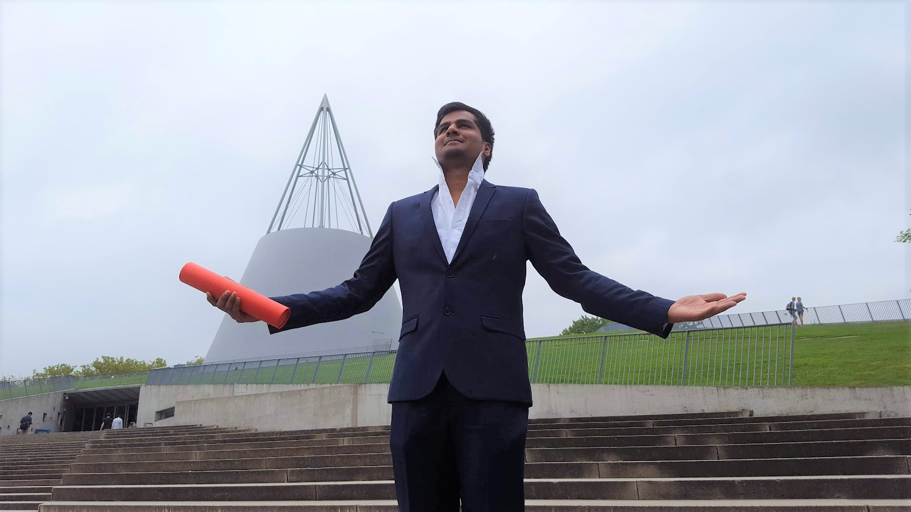

{:data-width="1605" data-height="903"}
{:.figure}

This proud guy holding a master degree from the Delft University of Technology is me. Re-winding back how I got here?. I was born on a cold Wednesday in the city of Chennai sharply at 4:15 pm. Too much Rewind and cliched like a movie opening scene. Speaking about movies, I love movies and binging tv series. Not a professional movie critic but not a C-grade audience, just an amateur blogger who likes to point out and write about films that touched his heart. Lost track with the about section, I was born and grew up in a small town named Vellore. Concordance with the time of birth, the beautiful hours after school, I also liked to sweat in the playground. Instead of concentrating on a single sport, I learnt one sport every year. With collars lifted, I will say that I know at least five sports that I can play at an intermediate level. Family pressure, economic status, society, culture and traditions did not mould me to become a sportsperson but put a book in front of my face. 

One good thing about me is that I can develop interests in whatever I do. This good trait of me created a penchant for my studies and helped me to clear competitive exams to get into a prestigious institution to do my Bachelors. My bachelor was in Instrumentation and Control, where I studied diverse technologies from electronics, coding, sensors, control systems and mathematics. Most of my Bachelor days, I spent mastering FIFA 14. 